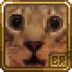

 
<h1>Empranion Battle Royale 🚀</h1>

<h2>About 📖</h2>

A mod made specially for the Terraria content creator, <a href="https://www.youtube.com/c/Empranion">Empranion</a>, to be able to host his custom events on his own <a href="https://discord.gg/Wg4JWHpgCf">Discord Server</a>. 

This mod provides the basics of a battle royale game, such as an anti cheat system to prevent users from benefiting of client side mods, an item blacklist to avoid mechanics that are often broken or not fitting, an inventory cleanup system to avoid cheated players, and so on... 

<h2>FAQ ❓</h2>

<b>Can I host games in a private server?</b> 
Unfortunately no, you cannot. This mod's sole purpose is for official events and nothing else.
